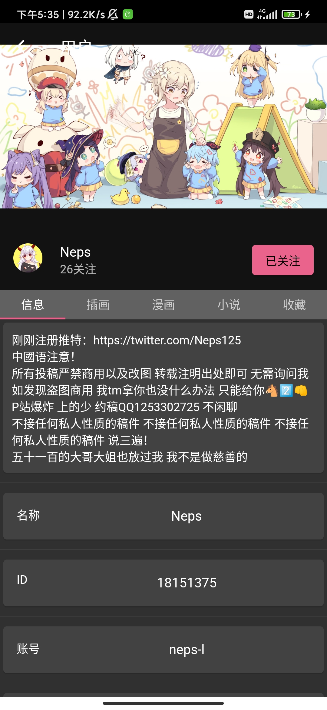
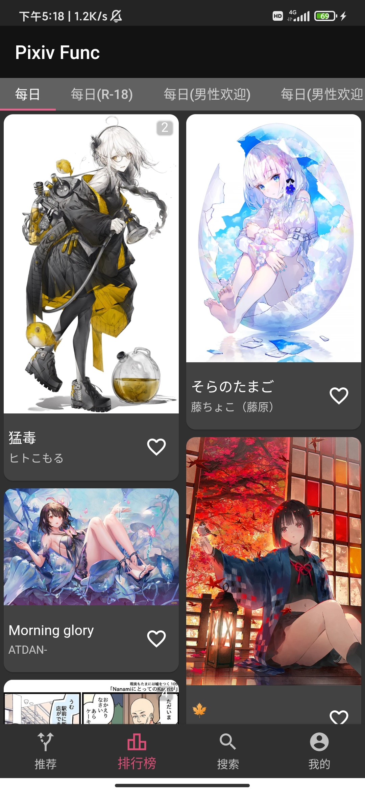
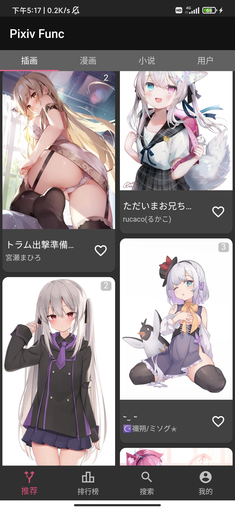

# Pixiv Func

- Pixiv第三方安卓客户端
- 使用了`GetX`状态管理框架
- 代码严格按照`flutter_lints`的规范编写
- 适合新手学习Flutter
- 这是我的个人玩具,与其他现有同类项目无关,如果你想拿我的项目跟其他项目比较,那么请你离开,我并不欢迎你
- 该项目用于我个人学习Flutter,开源且免费
- 有哪里出现问题或者需要新功能,欢迎打开[Issue](https://github.com/xiao-cao-x/pixiv_func_mobile/issues/new)
# 下载

| 下载最新版本                                                                                                                    |  |
|---------------------------------------------------------------------------------------------------------------------------|----------------------------------------------------------------------------------------------------------------------------------------------------------------------------------|
| [方式1(点击下载)](https://github.com/xiao-cao-x/pixiv_func_mobile/releases/latest/download/app-release.apk)                     | github.com                                                                                                                                                                       |
| [方式2(点击下载)](https://ghproxy.com/https://github.com/xiao-cao-x/pixiv_func_mobile/releases/latest/download/app-release.apk) | ghproxy.com(国内用这个)                                                                                                                                                               |

# 支持功能

| 名称                | 备注                                                                                                                                                                                                                                                                              |
|-------------------|---------------------------------------------------------------------------------------------------------------------------------------------------------------------------------------------------------------------------------------------------------------------------------|
| 登录                | 用的 [WebView](https://github.com/xiao-cao-x/pixiv_func_mobile/blob/main/android/app/src/main/kotlin/top/xiaocao/pixiv/platform/webview/PlatformWebView.kt) 支持免代理直连([本地反向代理](https://github.com/xiao-cao-x/pixiv-local-reverse-proxy))                                            |
| 浏览历史记录            | 存储在`SQLite`数据库中 可以在设置中开关                                                                                                                                                                                                                                                        |
| 查看推荐作品            | 插画/漫画/小说                                                                                                                                                                                                                                                                        |
| 查看收藏作品            | 插画&漫画/小说                                                                                                                                                                                                                                                                        |
| 查看已关注用户的最新作品      |                                                                                                                                                                                                                                                                                 |
| 查看陌生人的最新作品        | 插画&漫画/小说                                                                                                                                                                                                                                                                        |
| 查看关注用户            |                                                                                                                                                                                                                                                                                 |
| 查看排行榜             |                                                                                                                                                                                                                                                                                 |
| 推荐                | 推荐用户/推荐标签                                                                                                                                                                                                                                                                       |
| 搜索插画&漫画/小说        | 支持排序,支持时间范围,支持搜索ID,支持按收藏数量搜索                                                                                                                                                                                                                                                    |
| 搜索用户              | 支持搜索ID                                                                                                                                                                                                                                                                          |
| 图片搜源              | [集成了一个外部网站(非WebView)](https://github.com/xiao-cao-x/pixiv_func_mobile/blob/main/lib/pages/search/result/image/controller.dart#L104)                                                                                                                                             |
| 查看小说              | [解析HTML(非WebView)](https://github.com/xiao-cao-x/pixiv_func_mobile/blob/main/lib/pages/novel/controller.dart#L40)                                                                                                                                                               |
| 查看动图              | [Native解压](https://github.com/xiao-cao-x/pixiv_func_mobile/blob/main/android/app/src/main/kotlin/top/xiaocao/pixiv/platform/api/PlatformApi.kt#L60)   [CustomPainter播放](https://github.com/xiao-cao-x/pixiv_func_mobile/blob/main/lib/components/frame_gif/frame_gif.dart) 支持暂停 |
| 保存动图              | [Native合成](https://github.com/xiao-cao-x/pixiv_func_mobile/blob/main/android/app/src/main/kotlin/top/xiaocao/pixiv/platform/api/PlatformApi.kt#L26)                                                                                                                             |
| 保存原图到系统相册         | 可以查看下载任务                                                                                                                                                                                                                                                                        |
| 关注和取消关注(用户)       |                                                                                                                                                                                                                                                                                 |
| 收藏和取消收藏(插画&漫画/小说) |                                                                                                                                                                                                                                                                                 |
| 国际化               | 几乎全是机翻(欢迎PR)                                                                                                                                                                                                                                                                    |

# 关于免代理直连

1. API是强制开启的,图片源可以自选选择
2. 登录(PlatformWebView) 可以选择是否启用(本地反向代理绑定`12345`端口注意不要占用)

## 关于直连失效

1. 与运营商有关
2. 与地区有关
3. 可能间歇性的失效
4. 如果无法直连请开代理

# 预览

|  |  |  |
|-----------------------------------------------|-----------------------------------------------|-----------------------------------------------|
|  |  |  |

# 鸣谢

> 感谢 [JetBrains](https://www.jetbrains.com/?from=xiao-cao-x/pixiv_func_mobile) 为开源项目提供的以下IDE的免费授权

  

