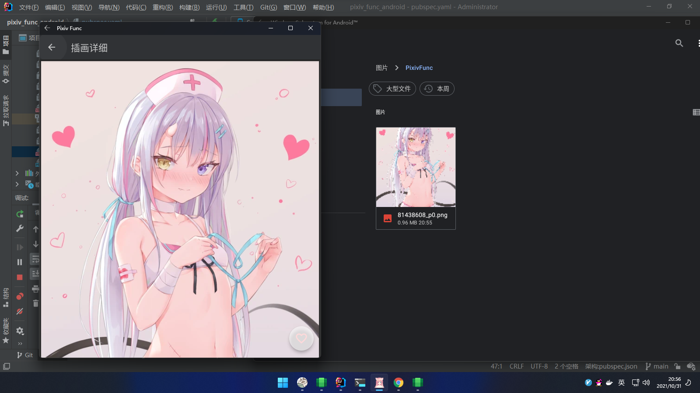

# 你好,色批人

### _该项目与一切现有同类项目无关,请不要拿来比较_

此软件开源且免费(不收取打赏) 禁止用于盈利(包括但不仅限于收取打赏)

如果发现Bug或者不合理的地方或者想要新增功能(我会酌情考虑要不要做)
请打开一个 [Issue](https://github.com/xiao-cao-x/pixiv_func_android/issues/new) 哦

如果你觉得我的软件好用 可以推荐给朋友

---

| 下载最新版本 |  |
| --- | --- |
| [方式1(点击下载)](https://github.com/xiao-cao-x/pixiv_func_android/releases/latest/download/app-release.apk) | github.com |
| [方式2(点击下载)](https://ghproxy.com/https://github.com/xiao-cao-x/pixiv_func_android/releases/latest/download/app-release.apk) | ghproxy.com(国内用这个) |

支持功能如下

| 名称 | 备注 |
| --- | --- |
| 登录 | 用的 [WebView](https://github.com/xiao-cao-x/pixiv_func_android/blob/main/android/app/src/main/kotlin/top/xiaocao/pixiv/platform/webview/PlatformWebView.kt) 支持免代理直连(本地反向代理) |
| 浏览历史记录 | 存储在`SQLite`数据库中 可以在设置中开关 |
| 查看推荐作品 | 插画/漫画/小说 |
| 查看收藏作品 | 插画&漫画/小说  |
| 查看已关注用户的最新作品  |  |
| 查看陌生人的最新作品 | 插画&漫画/小说 |
| 查看关注用户 |  |
| 查看排行榜 |  |
| 推荐 | 推荐用户/推荐标签 |
| 搜索插画&漫画/小说  | 支持排序,支持时间范围,支持搜索ID,支持按收藏数量搜索 |
| 搜索用户 | 支持搜索ID |
| 图片搜源 | [集成了一个外部网站(非WebView)](https://github.com/xiao-cao-x/pixiv_func_android/blob/main/lib/view_model/search_image_result_model.dart#L98) |
| 查看小说 | [解析HTML(非WebView)](https://github.com/xiao-cao-x/pixiv_func_android/blob/main/lib/view_model/novel_model.dart) |
| 查看动图 | [Native解压](https://github.com/xiao-cao-x/pixiv_func_android/blob/main/android/app/src/main/kotlin/top/xiaocao/pixiv/platform/api/PlatformApi.kt#L60)   [CustomPainter播放](https://github.com/xiao-cao-x/pixiv_func_android/blob/main/lib/ui/widget/gif_view.dart) 支持暂停 |
| 保存动图 | [Native合成](https://github.com/xiao-cao-x/pixiv_func_android/blob/main/android/app/src/main/kotlin/top/xiaocao/pixiv/platform/api/PlatformApi.kt#L26) |
| 保存原图到系统相册 | 可以查看下载任务 |
| 关注和取消关注(用户) |  |
| 收藏和取消收藏(插画&漫画/小说) |  |

适用于 Windows Subsystem for Android™

---

# 关于免代理直连:

1. API是强制开启的,图片源可以自选选择
2. 登录(PlatformWebView) 可以选择是否启用(本地反向代理绑定`12345`端口注意不要占用)

# 关于直连失效

1. 与运营商有关
2. 与地区有关
3. 可能间歇性的失效
4. 如果无法直连请开代理

---

 
菜单

---

 
推荐作品

---

 
关注的用户

---

 
排行榜

---

 
搜索

### `推荐用户`

### `推荐标签`

### `搜索输入`

### `搜索过滤器`

### `搜索关键字`

### `图片搜源`

---

 
用户详细

### `用户信息`

### `用户插画`

---

 
插画详细

